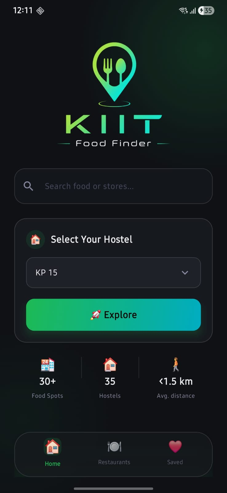
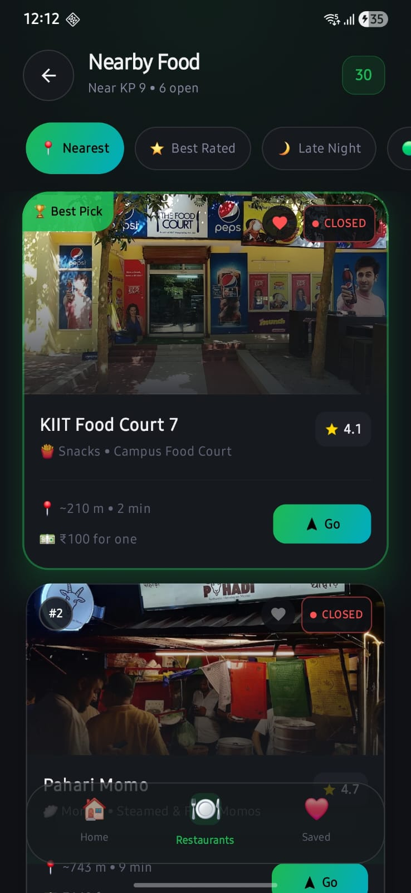
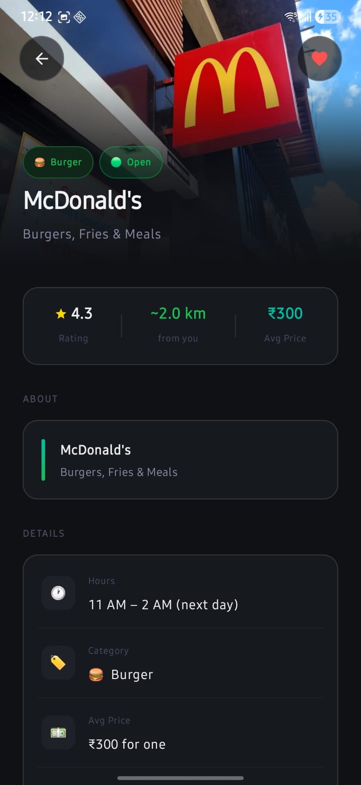
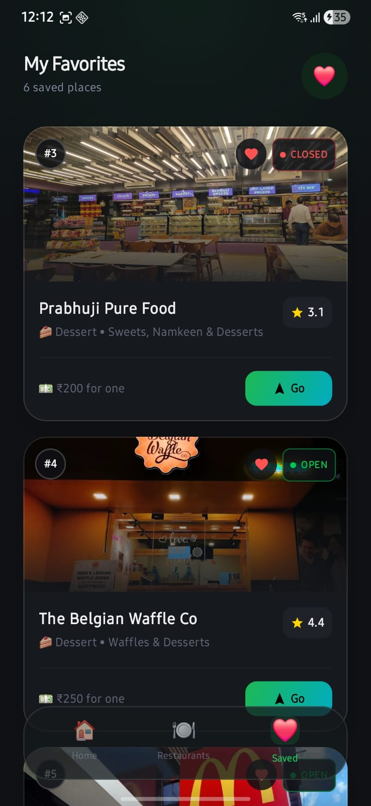
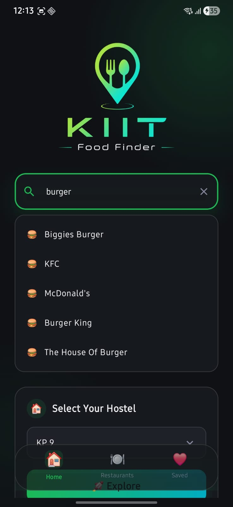

# 🍽️ KIIT Food Finder

> A cinematic Android food discovery experience built for KIIT students.
> Find nearby restaurants, cafés, desserts, late-night food spots, and student favorites around campus with a polished premium UI.

---

## 📲 Download APK

[⬇ Download KIIT Food Finder v2.0](https://github.com/sayakbhattasali/kiit-food-finder/releases/latest)

---

# ✨ About The Project

KIIT Food Finder is a modern Android application designed to help KIIT students quickly discover nearby food spots based on their hostel location.

Built with a dark cinematic aesthetic, the app focuses on:

* smooth user experience
* intelligent food discovery
* premium UI design
* realistic distance & budget estimation
* fast hostel-based recommendations

This project evolved from a simple food finder into a polished student-focused experience inspired by the atmosphere of campus life.

---

# 🚀 Features

### 🏠 Hostel-Based Discovery

* Supports 35+ KIIT hostels
* Personalized nearby food recommendations
* Smart distance calculations

### 🍔 Rich Restaurant Ecosystem

* Fast food chains
* Cafés
* Dessert spots
* Budget food joints
* Student favorites
* Late-night food places

### 🎯 Smart Filtering

* Nearest
* Best Rated
* Cheapest
* Open Now
* Late Night

### 🏆 Hero Recommendation System

Dynamic “Best Pick” highlighting for intelligent discovery.

### 💰 Realistic Budget Sorting

Uses actual estimated pricing instead of generic categories.

### 📍 Walking Time Estimation

Distance + walking time support for practical navigation.

### ❤️ Favorites System

Save your preferred restaurants for quick access.

### 🎨 Cinematic UI Experience

* Dark premium aesthetic
* Glassmorphism-inspired cards
* Smooth animations
* Premium surface hierarchy
* Floating navigation design
* Dynamic loading transitions

---

# 📸 Screenshots

## 🏠 Home Screen

<p align="center">
  
</p>

---

## 🍽️ Nearby Food Discovery

<p align="center">
  
</p>

---

## 📍 Store Details

<p align="center">
  
</p>

---

## ❤️ Favorites

<p align="center">
  
</p>

---

## 🔍 Smart Search

<p align="center">
  
</p>

---

## 🛠️ Tech Stack

* Kotlin
* Jetpack Compose
* Android Studio
* Material 3
* Google Maps Intents
* State Management
* Modern Android UI Architecture

---

# 🎨 Design Philosophy

Instead of building a generic utility app, KIIT Food Finder was designed to feel immersive and cinematic — something that visually reflects the atmosphere of late-night food runs, café hopping, and campus life around KIIT.

The app focuses heavily on:

* motion
* visual depth
* clean typography
* premium dark aesthetics
* emotional UI presentation

---

# 📦 Release

Current Version:

```text
v2.0
```

Major improvements in v2.0:

* premium UI overhaul
* expanded restaurant system
* improved filtering
* hostel expansion
* hero recommendation cards
* better visual hierarchy
* smarter sorting system
* enhanced animations
* refined navigation experience

---

# ❤️ Built For KIIT Students

A small project inspired by campus life, food culture, and the little places students slowly become attached to.

---
